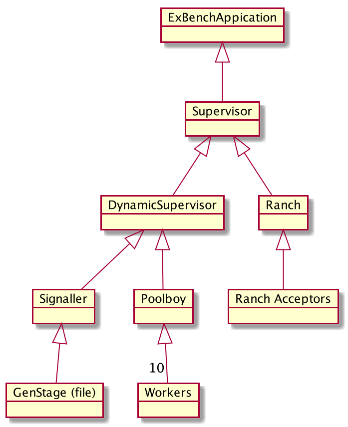

# ExBench

An application for white box load testing 

## Configuration

```elixir
config :poc_event_timer,
  workers: 2,  #number of poolby worker processes
  overflow: 2, # temporarily allocate these if needed
  concurrency: 2, # how many instances of the task should be run in parallel
  bench_fun: fn x -> IO.inspect(x) end, # the function that you apply to each line of input
  producer: ExBench.FileProducer, # this produces the inputs (in this example, it reads them from the specified file)
  producer_argument: %{filename: "./test/consult.me"} # the argument applied to producer.init/1
```

## Application design



## Tricks

### Make a bigger input arguments file

```bash
for i in `seq 1 10000` ;  do echo "{test1,{\"$i\", <<7,166>>, #{},[],false, #{<<\"x\">> => <<\"y\">>}}}." ; done >> test/consult.me
```
